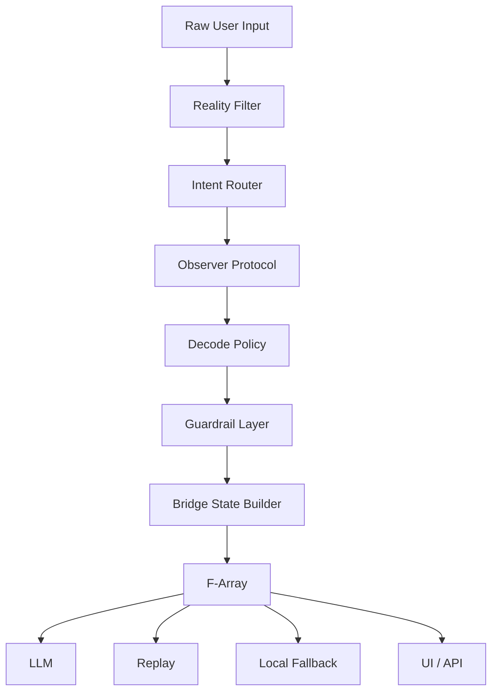

# Altora Core

Experimental LLM middleware for explicit runtime state, guardrails, and stateless AI workflows.

> This repository is a public portfolio version.
> The full implementation remains private.

---

# Problem

Modern LLM applications often depend on:

- Long prompts
- Hidden conversation history
- Implicit runtime state
- Model-specific behavior
- Weak runtime guardrails

These systems become difficult to debug, replay, validate, and safely scale.

---

# Solution

Altora Core explores a different architecture.

Instead of passing raw prompts directly to an LLM, the system converts user input into explicit runtime state before inference.

Core principle:

Intent → Structure → Exposure

The runtime exposes structured metadata, preserves guardrails, and supports stateless workflows.

---

# What Altora Core Is

Altora Core is an experimental LLM middleware layer.

It is designed for:

- Intent routing
- Runtime guardrails
- Stateless AI workflows
- Constraint-preserving state transfer
- Local fallback
- Bridge-state serialization
- AI runtime orchestration

It is **not** a chatbot.

---

# Runtime Flow



---

# Architecture

Altora Core transforms raw user input into structured runtime state before passing it to downstream systems.

Pipeline:

Raw User Input

↓

Reality Filter

↓

Intent Router

↓

Observer Protocol

↓

Decode Policy

↓

Guardrail Layer

↓

Bridge State Builder

↓

F-Array State Packet

↓

LLM / Local Fallback / Replay / UI

---

# Technical Highlights

## Runtime State

The runtime exposes explicit structural metadata rather than relying on hidden context.

Examples:

- Intent
- Runtime mode
- Guardrails
- Reality state
- Observer state
- Decode policy
- Bridge packet

---

## Intent Routing

Classifies the user's primary intent before inference.

Examples:

- explanatory
- architectural
- strategic
- planning
- decision
- relational

---

## Reality Filter

Classifies runtime context such as:

- controllability
- observation asymmetry
- trust weighting
- emotional pressure

---

## Observer Protocol

Prevents unstable observations from becoming fixed conclusions.

---

## Decode Policy

Delays premature interpretation.

The runtime preserves ambiguity when evidence is insufficient.

---

## Runtime Guardrails

Guardrails exist as runtime state instead of natural-language prompts.

Examples:

- execution blocked
- oracle blocked
- escalation blocked
- human review required

---

## F-Array

F-Array is Altora Core's structural runtime encoding format.

It is not prompt compression.

It is constraint-preserving state serialization.

Example:

```
I=nrm;T=T06;P=1;F=F13,F14;A=A02;R=R01;S=none;X=0;G=0;O=0
```

Permission bits:

- X = execution
- G = gate escalation
- O = oracle authority

---

## Local Fallback

Altora Core supports local-only execution.

Example:

```
requested_useCore: true

final_useCore: false

route_reason: local_only_fallback
```

The runtime remains observable even when no external model is used.

---

# Current Status

Current implementation includes:

- Runtime pipeline
- Intent routing
- Reality filtering
- Observer protocol
- Decode policy
- Runtime guardrails
- Local fallback
- Bridge-state packets
- F-Array encoding
- Sample runtime metadata

---

# Future Work

Planned work includes:

- Public F-array dictionary
- Bridge unpack endpoint
- Bridge validation endpoint
- Runtime benchmarks
- Guard retention tests
- SDK examples
- OpenAPI specification

---

# Repository Scope

Included:

- Architecture overview
- Runtime concepts
- Safety documentation
- Module descriptions
- Sample outputs

Not included:

- Private implementation
- Internal routing logic
- Runtime cache
- Experimental heuristics
- Production source code
- VPS configuration
- API keys

---

# Tech Stack

- Node.js
- JavaScript
- Express
- REST API
- Linux VPS
- PM2

---

# Why This Project Matters

Most LLM applications focus on better prompts.

Altora Core explores a different direction:

Make runtime state explicit.

Represent guardrails structurally.

Transfer constraints together with meaning.

Support stateless and observable AI workflows.

---

# License

This repository is a public architecture portfolio.

The full implementation remains private.
