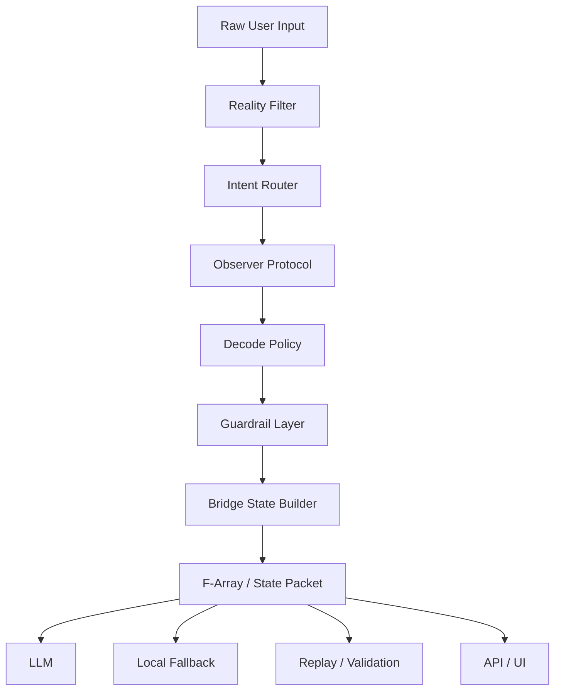

# Altora Core

Experimental LLM Orchestration & Safety Middleware

> Public portfolio version.
> The complete implementation remains private.

---

# Problem

Many LLM applications rely heavily on:

- Long prompts
- Hidden conversation history
- Implicit runtime state
- Weak intent routing
- Prompt-only safety
- Model-dependent behavior

These systems become difficult to inspect, validate, replay, and safely scale.

---

# Solution

Altora Core introduces an explicit runtime pipeline.

Instead of passing raw prompts directly to a model, it converts user input into structured runtime state before any downstream reasoning occurs.

Core principle:

**Intent → Structure → Exposure**

---

# System Flow



---

# What This Project Demonstrates

- LLM middleware architecture
- Intent routing
- Runtime guardrails
- Stateless AI workflows
- Local fallback architecture
- Constraint-preserving state transfer
- Bridge state serialization
- Human-in-the-loop boundaries

---

# Technical Highlights

## Explicit Runtime State

Instead of relying on hidden conversational context, runtime information is represented as structured state.

---

## Intent Routing

User input is classified before downstream processing.

Example categories:

- Normal
- Planning
- Strategic
- Decision
- Relational
- Architectural

---

## Reality Filter

The runtime evaluates contextual properties before reasoning.

Examples:

- controllability
- observation asymmetry
- trust weighting
- emotional pressure
- domain classification

---

## Observer Protocol

Prevents premature certainty when observations are incomplete or asymmetric.

---

## Decode Policy

Delays interpretation collapse.

The runtime preserves ambiguity until sufficient structural evidence exists.

---

## Bridge State

Intermediate runtime representation passed between modules.

This enables explicit state transfer across stateless workflows.

---

## F-Array

F-Array is a constraint-preserving structural state encoding.

Rather than compressing text, it compresses runtime state.

Example:

```text
I=nrm;T=T06;P=1;F=F13,F14;A=A02;R=R01;S=none;X=0;G=0;O=0
```

Permission fields:

- X = execution permission
- G = gate escalation
- O = oracle / prediction authority

---

## Local Fallback

The runtime can continue producing structural metadata even when external models are unavailable.

Example:

```yaml
requested_useCore: true
final_useCore: false
route_reason: local_only_fallback
```

---

# Safety Boundary

Altora Core is designed around explicit runtime boundaries.

The public architecture does not include:

- hidden execution authority
- automatic action permission
- prediction authority
- oracle behavior
- unrestricted escalation

Human review remains required for sensitive interpretation.

---

# Repository Scope

Included:

- Architecture overview
- Runtime concepts
- F-Array overview
- Module documentation
- Safety model
- Sample bridge packets

Not included:

- Production implementation
- Internal routing logic
- Runtime cache
- Prompts
- Private heuristics
- Validation datasets
- Infrastructure configuration

---

# Future Work

Planned work includes:

- Public F-Array dictionary
- Bridge unpack specification
- Guard retention benchmark
- Execution leak testing
- Oracle leak testing
- SDK examples
- OpenAPI examples

---

# Tech Stack

- Node.js
- Express
- JavaScript
- REST API
- Linux VPS
- PM2

---

# Why This Project Is Different

Most LLM applications optimize prompts.

Altora Core explores explicit runtime architecture.

Its focus is not chatbot behavior, but structured state transfer, runtime safety, model fallback, and constraint-preserving orchestration.

---

# License

Portfolio version.

The production implementation remains private.
